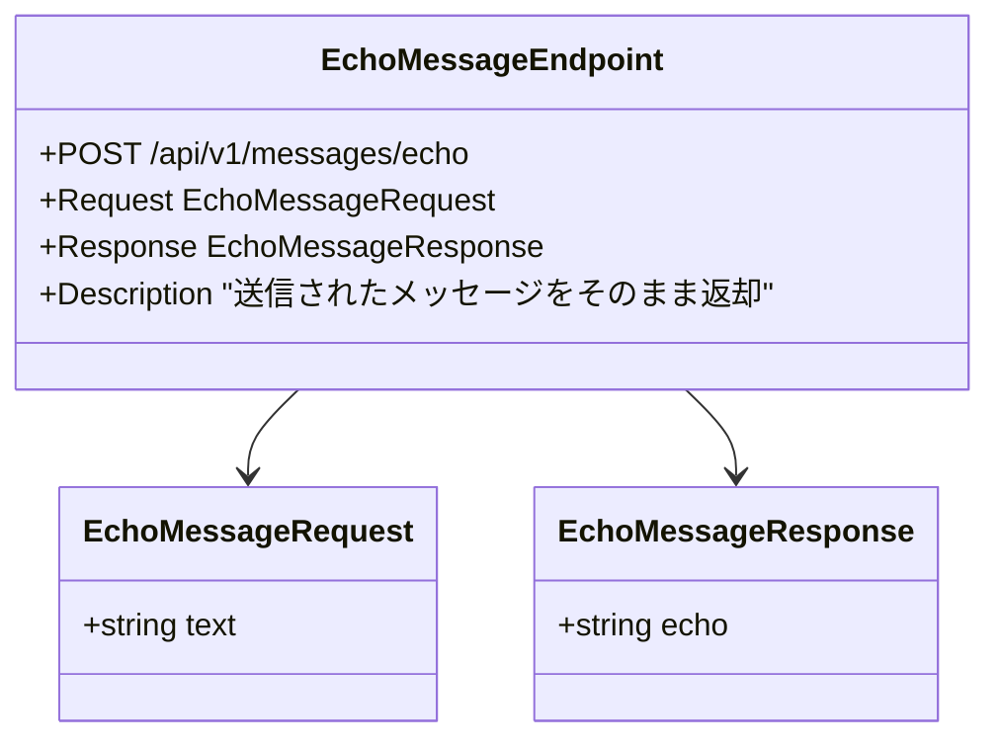

# API仕様書（メッセージエコー）

> **Note**
> このドキュメントは [openapi.yaml](./openapi.yaml) の内容を可読性向上のために Markdown 化したものです。
> 開発ツールや自動生成には YAML ファイルを使用してください。

FastAPI が提供する API の入出力構造を以下に示します。

<!-- MERMAID-START -->

<!-- MERMAID-END -->

## エンドポイント詳細

| 項目 | 内容 |
| --- | --- |
| メソッド | POST |
| パス | `/api/v1/messages/echo` |
| 概要 | 受け取ったメッセージを `echo` フィールドに乗せて返却 |
| 認証 | 不要 |

### リクエスト

```jsonc
{
  "text": "文字列（必須）"
}
```

### レスポンス

```jsonc
{
  "echo": "受信した文字列"
}
```
