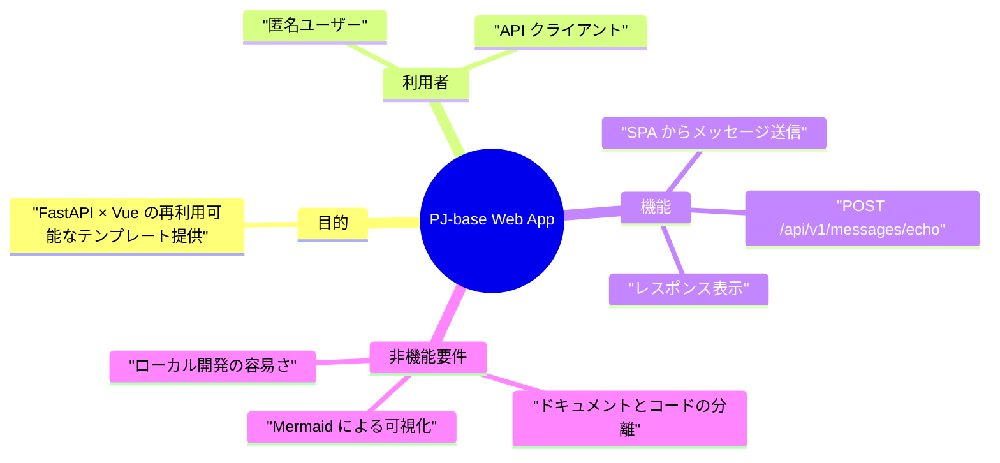

# 機能仕様書（PJ-base Webアプリ）

PJ-base Webアプリは FastAPI と Vue.js を組み合わせたループバック機能のサンプルです。以下のマインドマップで全体像を整理します。

```mermaid
mindmap
  root((PJ-base Web App))
    目的
      "FastAPI × Vue の再利用可能なテンプレート提供"
    利用者
      "匿名ユーザー"
      "API クライアント"
    機能
      "SPA からメッセージ送信"
      "POST /api/v1/messages/echo"
      "レスポンス表示"
    非機能要件
      "ドキュメントとコードの分離"
      "Mermaid による可視化"
      "ローカル開発の容易さ"
```
