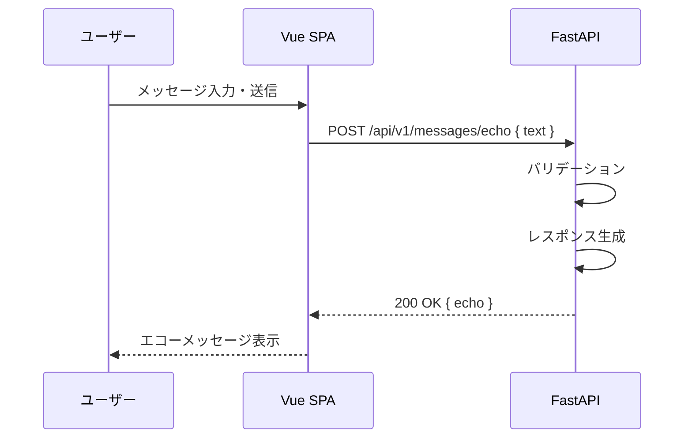

# 詳細設計書（エコー機能）

ユーザー操作からレスポンス表示までの処理フローをシーケンス図で表現します。

```mermaid
sequenceDiagram
  participant U as ユーザー
  participant V as Vue SPA
  participant B as FastAPI

  U->>V: メッセージ入力・送信
  V->>B: POST /api/v1/messages/echo { text }
  B->>B: バリデーション
  B->>B: レスポンス生成
  B-->>V: 200 OK { echo }
  V-->>U: エコーメッセージ表示
```

## UI 挙動

- 送信ボタン押下後、API 応答までボタンを無効化
- 成功時は `Echo: ...` 形式で結果表示
- 失敗時はエラー文言を表示し、ブラウザコンソールに詳細ログを出力
